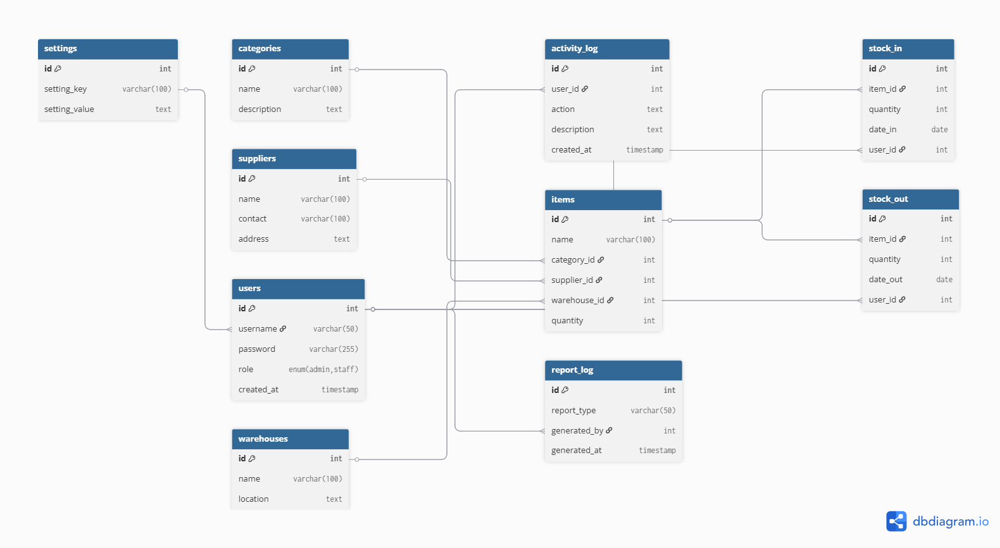

# Gudang Penyimpanan
---
Aplikasi ini dirancang untuk membantu pencatatan dan pengelolaan stok barang masuk dan keluar dari gudang.
## 💻 Sistem

1. XAMPP: versi 3.3.0
2.  Web Server Apache: versi 8.0.30 
3. PHP: Versi 8.0.30
4. MySQL: Versi 10.4.32 MariaDB

## 🔑Akses Login
- __Admin__
  Username: <span style="color: #e47e3aff;">remi</span>
  Password: <span style="color: #e47e3aff;">admin</span>

- __Staff__
  Username: <span style="color: #e47e3aff;">regi</span>
  Password: <span style="color: #e47e3aff;">staff</span>


## 📂Project File
- Salin [folder src](https://github.com/desinxcy/projectUasPemrograman/tree/src) ke direktori htdocs dan beri nama _guda_
```
xampp\htdocs\guda
```
- Download file [guda.sql](https://github.com/desinxcy/projectUasPemrograman)

## 🖥️ Lokal Server

- Buka aplikasi XAMPP 
- Aktifkan layanan _Apache_ dan _Mysql_

## 🗄️Buat Database 

- Buka _phpmyadmin_ di browser dengan menggunakan url:
```
  http://localhost/phpmyadmin
```
- Ekspor file __guda.sql__ untuk membuat database
## 🧩Skema Alur Penggunaan

klik link ini untuk melihat [Penjelasan lebih lengkap tentang cara penggunaan]()
```
[Login] --> [Dashboard]
              ↓
     [Barang] → [Stok Masuk]
              → [Stok Keluar]
              → [Kategori | Supplier | Gudang] ← (Admin Only)
              → [User Management] ← (Admin Only)
              → [Log Aktivitas] ← (Admin Only)
              ↓
            [Logout]
```
## Diagram ERD




